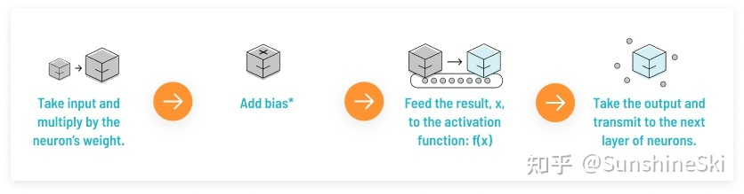
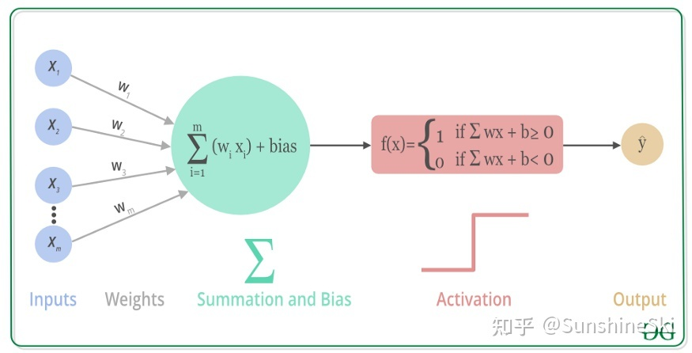
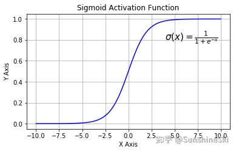
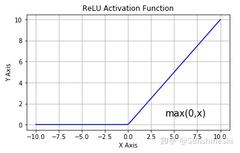

# 为什么需要激活函数？

神经网络的每一个神经元的工作流程可以总结为下图：

数学表达：

那么为什么需要激活函数？

从上图可以看出，神经网络中每一层的输入输出其实都是一个线性求和的过程，下一层的输出只是承接了上一层输入函数的线性变换，所以如果没有激活函数，那么无论你构造的神经网络多么复杂，有多少层，最后的输出都是输入的线性组合，纯粹的线性组合并不能够解决更为复杂的问题。**激活函数可以向神经网络中引入非线性因素，通过激活函数神经网络就可以拟合各种曲线。**

下面介绍一些常用的激活函数：

# Sigmoid

Sigmoid函数也叫Logistic函数，用于隐层神经元输出，取值范围为(0,1)，它可以将一个实数映射到(0,1)的区间，可以用来做二分类。在特征相差比较复杂或是相差不是特别大时效果比较好。sigmoid是一个十分常见的激活函数，函数的表达式如下：
$$
f(x) = \frac{1}{1+e^{-x}}
$$
函数图像如下：

**在什么情况下适合使用 Sigmoid 激活函数呢？**

- Sigmoid 函数的输出范围是 0 到 1。由于输出值限定在 0 到1，因此它对每个神经元的输出进行了归一化；
- 用于将预测概率作为输出的模型。由于概率的取值范围是 0 到 1，因此 Sigmoid 函数非常合适；
- 梯度平滑，避免「跳跃」的输出值；
- 函数是可微的。这意味着可以找到任意两个点的 sigmoid 曲线的斜率；
- 明确的预测，即非常接近 1 或 0。

**Sigmoid 激活函数存在的不足：**

- **梯度消失**：注意：Sigmoid 函数趋近 0 和 1 的时候变化率会变得平坦，也就是说，Sigmoid 的梯度趋近于 0。神经网络使用 Sigmoid 激活函数进行反向传播时，输出接近 0 或 1 的神经元其梯度趋近于 0。这些神经元叫作饱和神经元。因此，这些神经元的权重不会更新。此外，与此类神经元相连的神经元的权重也更新得很慢。该问题叫作梯度消失。因此，想象一下，如果一个大型神经网络包含 Sigmoid 神经元，而其中很多个都处于饱和状态，那么该网络无法执行反向传播。
- **不以零为中心**：Sigmoid 输出不以零为中心的,，输出恒大于0，非零中心化的输出会使得其后一层的神经元的输入发生偏置偏移（Bias Shift），并进一步使得梯度下降的收敛速度变慢。
- **计算成本高昂**：exp() 函数与其他非线性激活函数相比，计算成本高昂，计算机运行起来速度较慢。

# Tanh

# ReLu

ReLU函数又称为修正线性单元（Rectified Linear Unit），是一种分段线性函数，其弥补了sigmoid函数以及tanh函数的梯度消失问题，在目前的深度神经网络中被广泛使用。ReLU函数本质上是一个斜坡（ramp）函数，公式及函数图像如下：
$$
f(x) = max(0, x) 
     = \left\{ 
           \begin{array}{lc}
           x, & x \geqslant 0 \\
           0,&x<0\\
           \end{array}
       \right.
$$

ReLU 函数是深度学习中较为流行的一种激活函数，相比于 sigmoid 函数和 tanh 函数，它具有如下优点：

- 当输入为正时，导数为1，一定程度上改善了梯度消失问题，加速梯度下降的收敛速度；
- 计算速度快得多。ReLU 函数中只存在线性关系，因此它的计算速度比 sigmoid 和 tanh 更快。
- 被认为具有生物学合理性（Biological Plausibility）,比如单侧抑制、宽兴奋边界（即兴奋程度可以非常高）

**ReLU函数的不足：**

- Dead ReLU 问题。当输入为负时，ReLU 完全失效，在正向传播过程中，这不是问题。有些区域很敏感，有些则不敏感。但是在反向传播过程中，如果输入负数，则梯度将完全为零；

> **【Dead ReLU问题】**ReLU神经元在训练时比较容易“死亡”。在训练时，如果参数在一次不恰当的更新后，第一个隐藏层中的某个ReLU 神经元在所有的训练数据上都不能被激活，那么这个神经元自身参数的梯度永远都会是0，在以后的训练过程中永远不能被激活。这种现象称为死亡ReLU问题，并且也有可能会发生在其他隐藏层。

- 不以零为中心：和 Sigmoid 激活函数类似，ReLU 函数的输出不以零为中心，ReLU 函数的输出为 0 或正数，给后一层的神经网络引入偏置偏移，会影响梯度下降的效率。

# LReLU

# PReLU

# Elu

# Selu

# Gelu

# 参考资料：

[详解激活函数（Sigmoid/Tanh/ReLU/Leaky ReLu等） - 知乎 (zhihu.com)](https://zhuanlan.zhihu.com/p/427541517)

[深度学习笔记：如何理解激活函数？（附常用激活函数） - 知乎 (zhihu.com)](https://zhuanlan.zhihu.com/p/364620596)